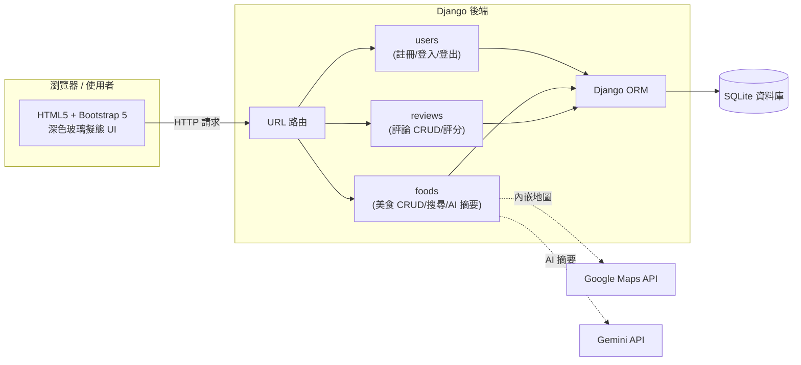
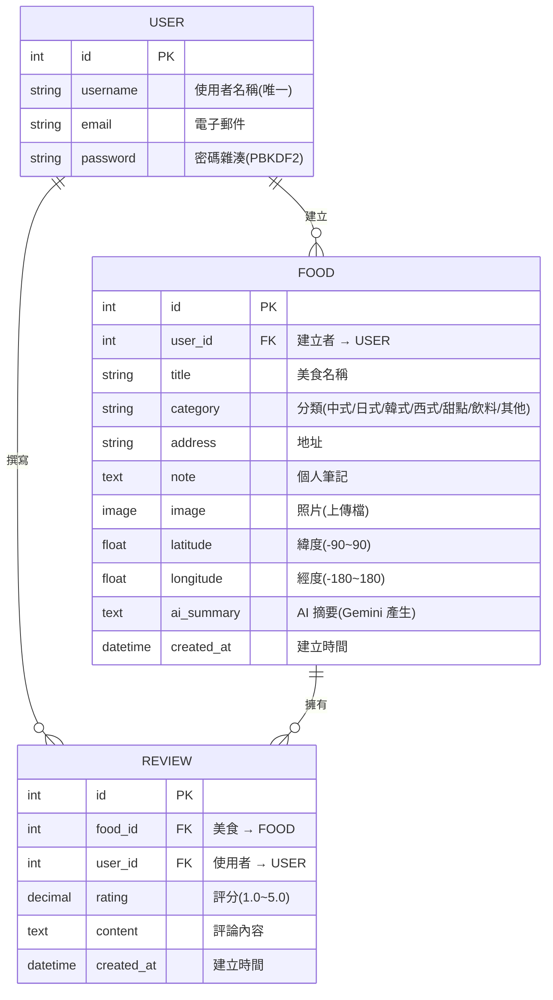
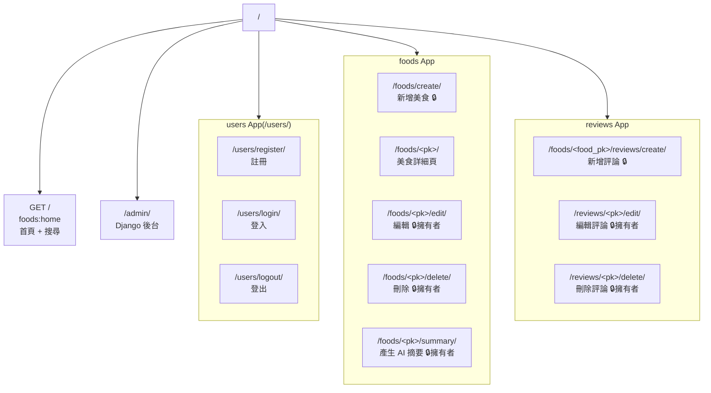
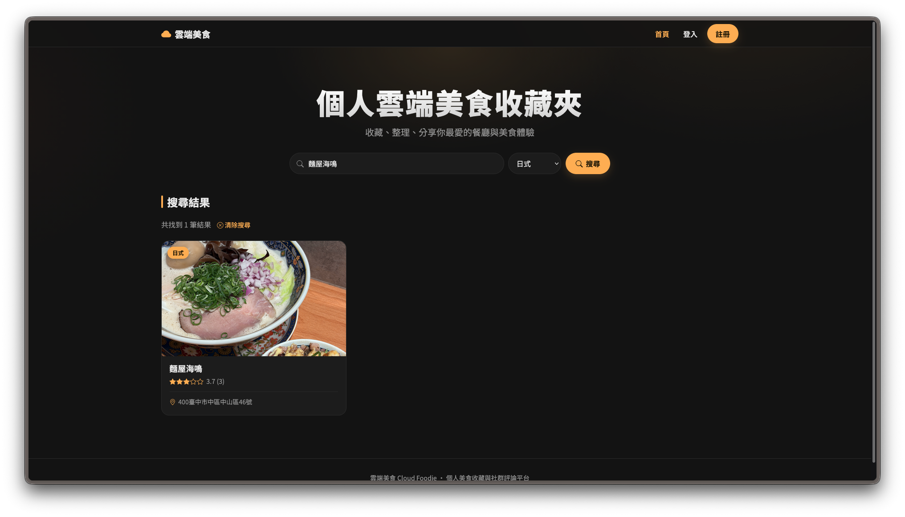
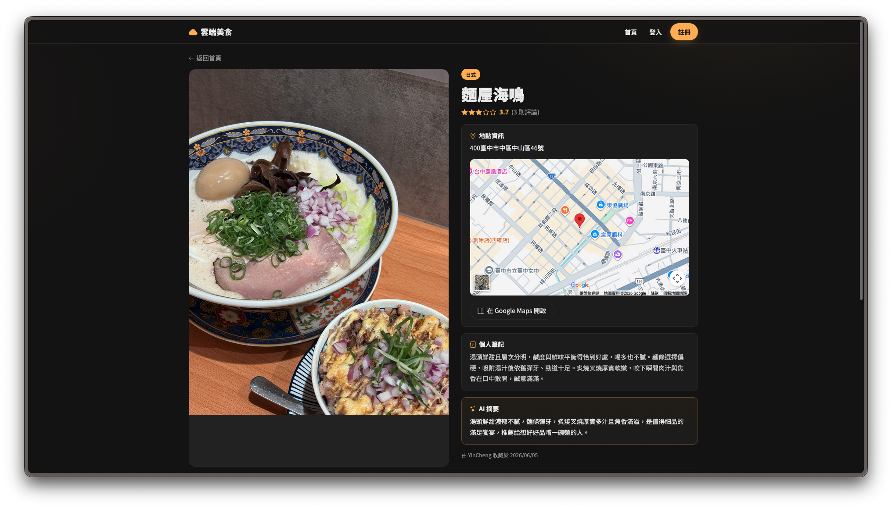
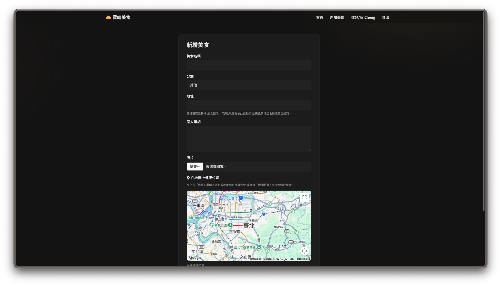
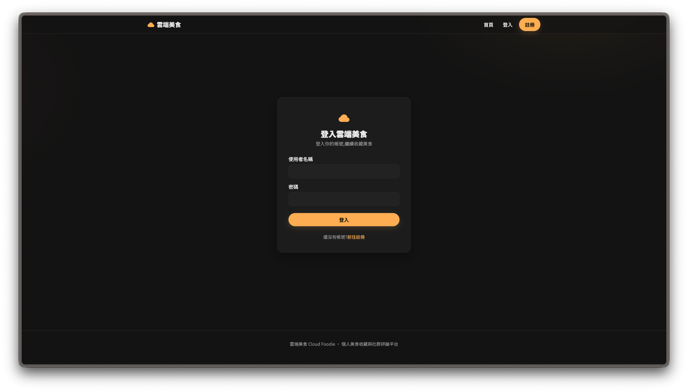
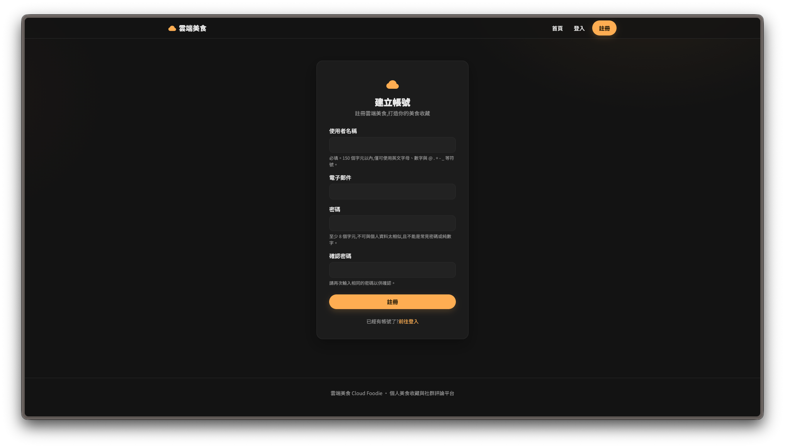
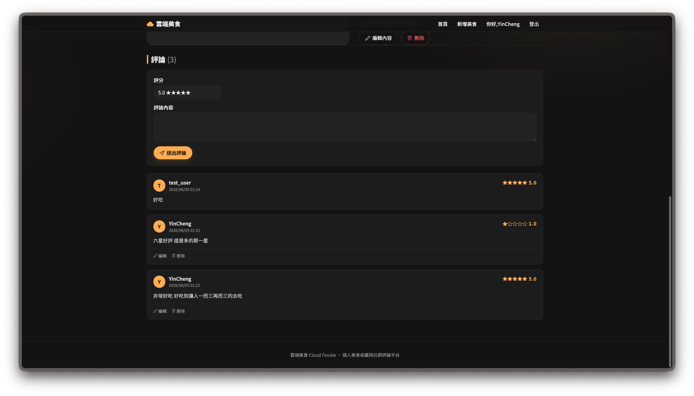
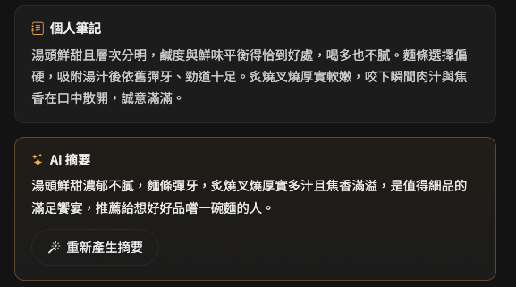

# 雲端美食 Cloud Foodie — 簡報準備文件

> 本文件為「動態網頁開發」課程專案的簡報輔助資料,內容**直接對應現行程式碼**(models、urls、views),可直接用於上台報告。
>
> 圖表採用 [Mermaid](https://mermaid.js.org/) 語法,於 GitHub、VS Code(裝 Mermaid 外掛)、Typora、HackMD 等皆可直接預覽。

---

## 目錄

1. [系統架構總覽](#1-系統架構總覽)
2. [T039 — ER 圖(資料庫關聯)](#2-t039--er-圖資料庫關聯)
3. [T040 — 路由設計](#3-t040--路由設計)
4. [T041 — JSON 資料範例](#4-t041--json-資料範例)
5. [T042 — 截圖清單](#5-t042--截圖清單)

---

## 1. 系統架構總覽



**技術堆疊**

| 分層 | 採用技術 |
| --- | --- |
| 前端 | HTML5、CSS3、Bootstrap 5、原生 JavaScript |
| 後端 | Django 5.2(LTS)、Django ORM |
| 資料庫 | SQLite |
| 第三方 API | Google Maps API、Gemini API |
| 身分驗證 | Django 內建 Authentication 系統 |
| 安全 | 密碼雜湊(PBKDF2)、CSRF 保護、輸入驗證 |

**三個 App 的職責分離**

- `users`:會員註冊、登入、登出(沿用 Django 內建 User 與驗證系統)
- `foods`:美食收藏的新增/檢視/編輯/刪除、搜尋、Google Maps、Gemini AI 摘要
- `reviews`:評論與評分(1.0~5.0)的新增/編輯/刪除

---

## 2. T039 — ER 圖(資料庫關聯)



**關聯說明**

| 關聯 | 關係 | 意義 |
| --- | --- | --- |
| `User` → `Food` | 1 : N | 一位使用者可收藏多筆美食 |
| `User` → `Review` | 1 : N | 一位使用者可撰寫多則評論 |
| `Food` → `Review` | 1 : N | 一筆美食可被多位使用者評論 |

> `User` 採用 Django 內建模型(`django.contrib.auth.models.User`),`password` 欄位儲存的是 PBKDF2 雜湊值,而非明文密碼。
> 刪除使用者或美食時,關聯的評論會以 `on_delete=CASCADE` 一併刪除。

---

## 3. T040 — 路由設計

### 3.1 路由結構圖



### 3.2 完整路由表

| 路徑 | HTTP 方法 | URL 名稱 | View | 權限 | 說明 |
| --- | --- | --- | --- | --- | --- |
| `/` | GET | `foods:home` | `home` | 公開 | 首頁、美食卡片、搜尋(名稱/分類) |
| `/foods/create/` | GET·POST | `foods:create` | `food_create` | 🔒 需登入 | 新增美食(圖片上傳、地圖選點) |
| `/foods/<pk>/` | GET | `foods:detail` | `food_detail` | 公開 | 美食詳細頁、地圖、評論、AI 摘要 |
| `/foods/<pk>/edit/` | GET·POST | `foods:edit` | `food_edit` | 🔒 擁有者 | 編輯美食 |
| `/foods/<pk>/delete/` | GET·POST | `foods:delete` | `food_delete` | 🔒 擁有者 | 刪除美食(確認頁) |
| `/foods/<pk>/summary/` | POST | `foods:summary` | `food_summary` | 🔒 擁有者 | 呼叫 Gemini 產生筆記摘要 |
| `/foods/<food_pk>/reviews/create/` | POST | `reviews:create` | `review_create` | 🔒 需登入 | 對美食新增評論與評分 |
| `/reviews/<pk>/edit/` | GET·POST | `reviews:edit` | `review_edit` | 🔒 擁有者 | 編輯評論 |
| `/reviews/<pk>/delete/` | GET·POST | `reviews:delete` | `review_delete` | 🔒 擁有者 | 刪除評論(確認頁) |
| `/users/register/` | GET·POST | `users:register` | `register` | 公開 | 會員註冊 |
| `/users/login/` | GET·POST | `users:login` | `LoginView` | 公開 | 登入(已登入者自動導回首頁) |
| `/users/logout/` | POST | `users:logout` | `LogoutView` | 需登入 | 登出 |
| `/admin/` | GET·POST | — | Django Admin | 🔒 管理員 | 後台管理 |

> 🔒 **需登入**:以 `@login_required` 裝飾器保護,未登入會導向登入頁。
> 🔒 **擁有者**:除需登入外,view 內再以 `obj.user != request.user` 檢查,非擁有者無法編輯/刪除他人資料。
> 變更狀態的敏感操作(刪除、登出、產生摘要)一律走 **POST**,並受 CSRF token 保護。

---

## 4. T041 — JSON 資料範例

> 本專案以 Django Template 直接輸出 HTML 畫面;以下 JSON 為三個資料模型的**標準序列化表示**,用於說明資料結構(若日後擴充 REST API,回應格式即如此)。

### 4.1 單筆美食(含巢狀評論與平均評分)

`GET /foods/1/` 對應的資料結構:

```json
{
  "id": 1,
  "user": {
    "id": 3,
    "username": "YinCheng"
  },
  "title": "麵屋海鳴",
  "category": "japanese",
  "category_display": "日式",
  "address": "台南市中西區國華街三段",
  "note": "拉麵湯頭濃郁,叉燒入口即化,價格中等,值得再訪。",
  "image_url": "/media/foods/menya-umi.jpg",
  "latitude": 22.9985,
  "longitude": 120.1971,
  "ai_summary": "推薦濃郁湯頭與軟嫩叉燒,平價拉麵,適合再訪。",
  "created_at": "2026-06-01T12:30:00+08:00",
  "average_rating": 4.5,
  "review_count": 2,
  "reviews": [
    {
      "id": 11,
      "user": { "id": 5, "username": "FoodieAmy" },
      "rating": 5.0,
      "content": "湯頭超讚,麵條彈牙!",
      "created_at": "2026-06-02T18:05:00+08:00"
    },
    {
      "id": 12,
      "user": { "id": 8, "username": "RamenFan" },
      "rating": 4.0,
      "content": "份量略少,但味道很到位。",
      "created_at": "2026-06-03T19:20:00+08:00"
    }
  ]
}
```

### 4.2 首頁美食列表(卡片用,含平均評分)

`GET /` 對應的資料結構:

```json
{
  "query": "",
  "selected_category": "",
  "count": 2,
  "results": [
    {
      "id": 1,
      "title": "麵屋海鳴",
      "category_display": "日式",
      "image_url": "/media/foods/menya-umi.jpg",
      "average_rating": 4.5,
      "review_count": 2
    },
    {
      "id": 2,
      "title": "春水堂",
      "category_display": "飲料",
      "image_url": "/media/foods/chunshuitang.jpg",
      "average_rating": null,
      "review_count": 0
    }
  ]
}
```

### 4.3 Gemini AI 摘要回應

`POST /foods/1/summary/` 成功後寫回 `ai_summary` 的概念回應:

```json
{
  "food_id": 1,
  "ai_summary": "推薦濃郁湯頭與軟嫩叉燒,平價拉麵,適合再訪。",
  "model": "gemini-2.5-flash"
}
```

> 欄位對應:`image_url` 來自 `Food.image`;`category_display` 為 `get_category_display()` 的繁中顯示;`average_rating`/`review_count` 由 Django ORM 的 `Avg('reviews__rating')` 與 `Count('reviews')` 聚合產生,無評論時 `average_rating` 為 `null`。

---

## 5. T042 — 截圖清單

報告時建議依序截下列頁面(資料請先建立好,畫面較完整)。**請以深色主題、桌機寬度**截圖以呈現玻璃擬態效果。

### 5.1 截圖規格表

請依「**檔名**」欄將截圖存到 `docs/screenshots/`,下方 §5.2 嵌入區即會自動顯示。

| # | 頁面 | 路徑 | 檔名(存到 `docs/screenshots/`) | 畫面重點 |
| --- | --- | --- | --- | --- |
| 1 | **首頁(列表)** | `/` | `01-home.png` | 導覽列、搜尋列、3 欄美食卡片、星級評分、分類標籤 |
| 2 | 首頁(搜尋結果) | `/?q=拉麵&category=japanese` | `02-home-search.png` | 搜尋條件、結果筆數、「清除搜尋」 |
| 3 | **美食詳細頁** | `/foods/<id>/` | `03-detail.png` | 大圖、店家資訊、Google 地圖、平均評分、評論列表、AI 摘要卡片 |
| 4 | **新增美食** | `/foods/create/` | `04-create.png` | 圖片上傳、名稱/分類/地址、地圖選點(Places 自動完成)、個人筆記 |
| 5 | **登入頁** | `/users/login/` | `05-login.png` | 共用深色版型、玻璃卡片、繁中欄位 |
| 6 | 註冊頁 | `/users/register/` | `06-register.png` | 繁中欄位與密碼規則說明 |
| 7 | **評論系統** | `/foods/<id>/`(評論區) | `07-reviews.png` | 評分下拉(★)、評論表單、評論列表、擁有者可編輯/刪除 |
| 8 | (加分)AI 摘要 | `/foods/<id>/`(摘要卡) | `08-ai-summary.png` | 點「產生 AI 摘要」後由 Gemini 產出的繁中摘要 |

> 檔名也可用 `.jpg`,但需同步修改 §5.2 的副檔名。建議統一用 `.png`。

### 5.2 截圖嵌入區

> 下列圖片在你把檔案放進 `docs/screenshots/` 後會自動顯示;尚未放入前會顯示替代文字。

**1. 首頁(列表)**


**2. 首頁(搜尋結果)**



**3. 美食詳細頁**



**4. 新增美食**



**5. 登入頁**



**6. 註冊頁**



**7. 評論系統**



**8. AI 摘要(加分)**



### 5.3 截圖小撇步

- 啟動前先跑 `python manage.py seed_demo` 建立示範資料,首頁就有 10 張卡片可截。
- 以 `demo_amy` / `demo_ken` / `demo_lin`(密碼 `demopass123`)或你的 `YinCheng` 帳號登入,首頁與詳細頁才會顯示「編輯/刪除」「產生 AI 摘要」等擁有者功能。
- 詳細頁需要該美食已填地址或經緯度,地圖才會顯示(示範資料都已填好)。
- AI 摘要需設定 `GEMINI_API_KEY` 環境變數並先填寫「個人筆記」。
- macOS 區域截圖快捷鍵:**⌘ + Shift + 4**;視窗截圖:**⌘ + Shift + 4** 後按 **空白鍵**。

---

### 對應簡報主題對照

| 課程要求簡報主題 | 對應本文件章節 |
| --- | --- |
| 1. Web 架構 | §1 系統架構總覽 |
| 2. 路由設計 | §3 路由設計 |
| 3. 資料庫設計 / 4. ER 圖 | §2 ER 圖 |
| 5. JSON 範例 | §4 JSON 資料範例 |
| 6. UI 設計 | §5 截圖清單(實機畫面) |
| 7. Google Maps API | §1、§4(地圖整合)、詳細頁截圖 |
| 8. Gemini AI 整合 | §4.3、AI 摘要截圖 |
| 9. 安全設計 | 密碼雜湊 / CSRF / 輸入驗證(Milestone 9) |
| 10. 系統 Demo | §5 截圖清單依序操作 |
